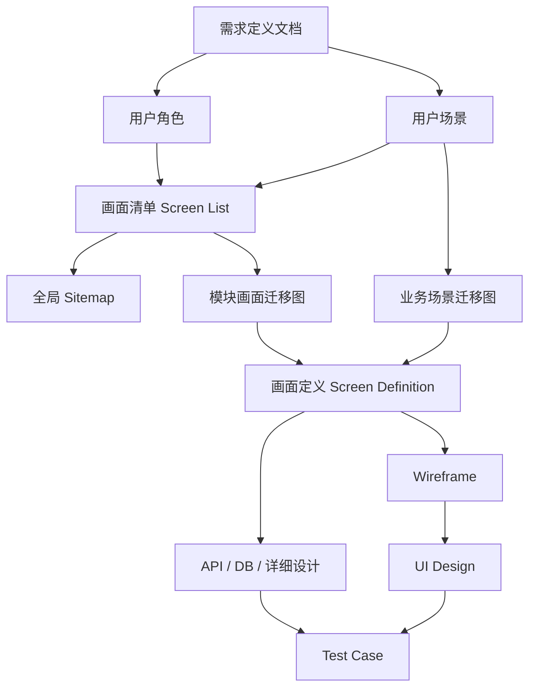
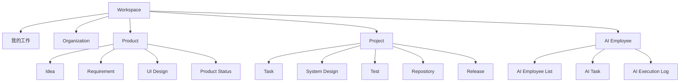
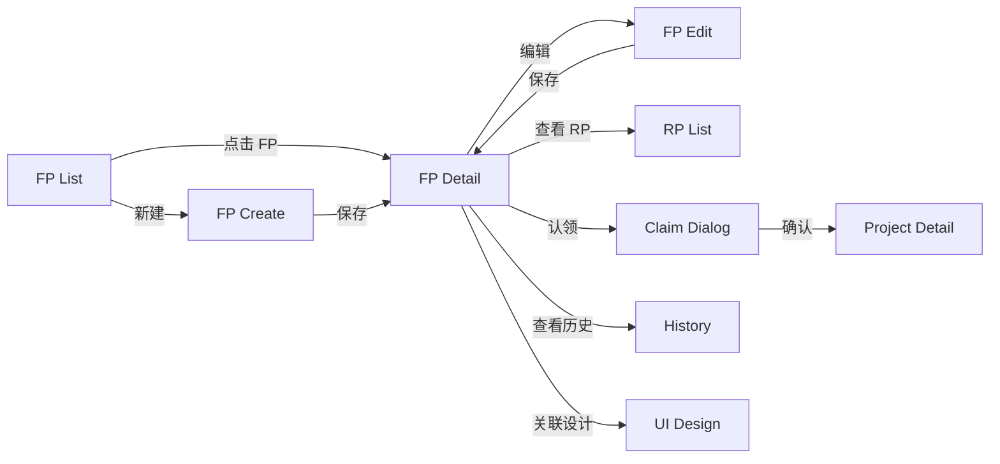
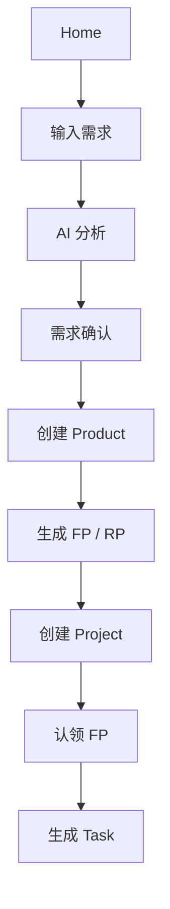
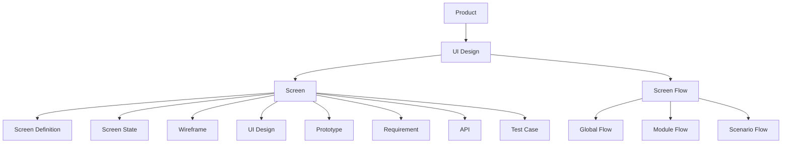
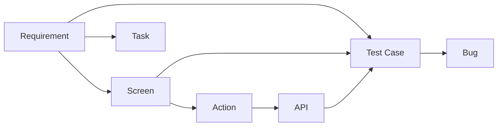

# 从需求定义到网站画面定义与画面迁移图的设计方法

> 适用于 good7ob 及类似的复杂 SaaS / 项目管理 / AI 协同平台

---

## 1. 文档目的

当系统已经具备较完整的需求定义文档后，下一阶段不建议立即进入高保真 UI 设计。

更合理的设计顺序应为：

```text
需求定义
  ↓
用户场景
  ↓
画面清单
  ↓
全局页面地图
  ↓
模块画面迁移图
  ↓
业务场景迁移图
  ↓
画面定义
  ↓
Wireframe
  ↓
UI Design
  ↓
API / DB / 详细设计
  ↓
测试用例
```

本方案的目标是建立一套可以长期维护的：

- 画面清单
- 画面定义
- 画面迁移图
- 页面状态定义
- 需求与画面的追踪关系
- 画面与 API / 测试的追踪关系

---

# 2. 为什么不要直接从需求进入 UI 设计

如果直接从需求文档进入 Figma 高保真设计，常见风险包括：

1. 页面数量不断膨胀
2. 相似页面重复设计
3. 页面之间跳转逻辑混乱
4. 缺少权限设计
5. 缺少异常状态
6. 缺少 Loading / Empty / Error 页面状态
7. UI 与需求无法建立追踪关系
8. 修改需求后，不知道影响哪些页面
9. 页面修改后，不知道影响哪些 API
10. 测试无法确认需求是否完整覆盖

因此应该先完成：

> 信息架构 + 页面结构 + 页面流转

再做视觉设计。

---

# 3. 总体设计流程

推荐流程：



---

# 4. 第一步：从需求定义提取用户场景

需求文档通常描述的是：

- 系统需要具备什么能力
- 用户可以做什么
- 系统应该满足什么业务规则

但画面设计更关注：

> 用户在什么情况下，想完成什么事情。

例如需求：

> 用户可以查看产品下的 FP，可以创建 FP、编辑 FP，并将 FP 认领到 Project。

不要直接画页面。

先转换成用户场景：

### Scenario 1

用户进入某个产品，希望查看当前所有 FP。

### Scenario 2

用户发现一个新的功能需求，希望创建 FP。

### Scenario 3

用户查看 FP 后，希望进一步查看 RP。

### Scenario 4

用户决定在某 Project 中实现该 FP，希望完成认领。

---

# 5. 第二步：建立画面清单

首先建立系统统一的 Screen ID。

推荐规则：

```text
SCR-{DOMAIN}-{NUMBER}
```

例如：

```text
SCR-PRODUCT-001
SCR-FP-001
SCR-FP-002
SCR-PROJECT-001
SCR-TASK-001
```

建议不要把具体动作写入 ID，例如：

```text
SCR-FP-CREATE
SCR-FP-EDIT
```

因为 Create / Edit 很可能后续合并成同一个 Form。

---

## 5.1 示例：需求管理模块

| Screen ID | 页面名称 | 页面类型 | 主要对象 |
|---|---|---|---|
| SCR-PRODUCT-001 | 产品详情 | Detail | Product |
| SCR-FP-001 | FP 一览 | List | FP |
| SCR-FP-002 | FP 详情 | Detail | FP |
| SCR-FP-003 | FP 创建 / 编辑 | Form | FP |
| SCR-FP-004 | FP 认领 | Dialog | FP / Project |
| SCR-RP-001 | RP 一览 | List | RP |
| SCR-RP-002 | RP 详情 | Detail | RP |

---

# 6. 页面类型建议统一

good7ob 建议定义标准页面类型。

例如：

| 类型 | 说明 |
|---|---|
| List | 数据列表 |
| Detail | 详情 |
| Form | 创建 / 编辑 |
| Dashboard | 数据看板 |
| Wizard | 多步骤操作 |
| Dialog | 对话框 |
| Drawer | 侧边抽屉 |
| Setting | 设置 |
| Workspace | 工作空间 |
| Timeline | 时间线 |
| Board | 看板 |

统一页面类型后，未来可以建立统一 UI 模板。

---

# 7. 第三步：设计三级画面迁移图

不建议整个系统只有一张巨大迁移图。

推荐三级结构：

```text
Level 1：Global Sitemap
Level 2：Module Flow
Level 3：Scenario Flow
```

---

# 8. Level 1：全局页面地图

全局页面地图用于回答：

> 系统有什么？

例如 good7ob：



它主要负责：

- 信息架构
- 导航结构
- 模块关系

不需要描述按钮级跳转。

---

# 9. Level 2：模块画面迁移图

模块画面迁移图回答：

> 用户在一个模块内部如何操作？

例如 Requirement 模块：



---

# 10. Level 3：业务场景迁移图

业务场景迁移图回答：

> 用户为了完成某件事情，需要经历哪些页面？

例如：

## 从模糊需求创建 Product



业务场景图非常重要。

因为 Sitemap 解决的是：

> 有哪些页面。

Scenario Flow 解决的是：

> 用户是否能够顺利完成工作。

---

# 11. 画面迁移关系建议结构化保存

未来 good7ob 可以把迁移关系做成数据，而不仅仅是一张 Mermaid 图。

例如：

```text
source_screen_id
action_id
target_screen_id
condition
permission
transition_type
```

示例：

| Source | Action | Target | Condition |
|---|---|---|---|
| SCR-FP-001 | OPEN_FP | SCR-FP-002 | FP exists |
| SCR-FP-001 | CREATE_FP | SCR-FP-003 | Editor |
| SCR-FP-002 | EDIT_FP | SCR-FP-003 | Editor |
| SCR-FP-002 | CLAIM_FP | SCR-FP-004 | Project exists |

这样可以自动生成画面迁移图。

---

# 12. 第四步：编写画面定义

完成画面清单和迁移图之后，再定义每一个页面。

---

# 13. Screen Definition 模板

## 基本信息

```text
Screen ID:
Screen Name:
Module:
URL:
Screen Type:
Primary Entity:
```

例如：

```text
Screen ID: SCR-FP-002
Screen Name: FP Detail
Module: Requirement
URL: /products/{productId}/requirements/{fpId}
Screen Type: Detail
Primary Entity: FP
```

---

# 14. 页面目的

每一个 Screen 必须回答：

> 这个页面为什么存在？

例如：

```text
查看并管理一个 FP 的完整信息。

用户可以：

- 查看 FP 基本信息
- 查看 RP
- 查看关联 Project
- 查看 UI Design
- 查看 Task
- 查看 Activity
- 评论
- 编辑 FP
- 认领 FP
```

---

# 15. 页面进入条件

例如：

```text
用户必须：

1. 已登录
2. 是当前 Organization 成员
3. 有 Product 查看权限
```

---

# 16. 页面来源

例如：

```text
可能来源：

- FP List
- Global Search
- Product Detail
- Project Detail
- Notification
- Comment Link
```

---

# 17. 页面结构定义

例如 FP Detail：

| Area | 内容 |
|---|---|
| Header | FP 编号、标题、状态、优先级 |
| Overview | 描述、目标、验收标准 |
| RP | 下属 RP |
| Project | 已认领项目 |
| UI Design | 关联 UI |
| Task | 关联任务 |
| Activity | 操作历史 |
| Comment | 评论 |

---

# 18. Action 定义

建议每个操作也有 ID。

规则：

```text
ACT-{DOMAIN}-{NUMBER}
```

例如：

| Action ID | Action | 权限 | 结果 |
|---|---|---|---|
| ACT-FP-001 | Edit FP | Editor | 打开编辑页面 |
| ACT-FP-002 | Create RP | Editor | 打开 RP 创建 |
| ACT-FP-003 | Claim | Project Manager | 打开 Claim Dialog |
| ACT-FP-004 | Delete | Admin | Confirm Dialog |
| ACT-FP-005 | View History | Viewer | History |

---

# 19. 页面状态必须定义

页面不是只有：

> 正常页面

至少需要考虑：

```text
Loading
Empty
Normal
No Permission
Error
Not Found
Archived
Deleted
Editing
Processing
```

对于 AI 功能，还应该考虑：

```text
AI Generating
AI Waiting
AI Running
AI Success
AI Failed
AI Partial Success
AI Cancelled
```

---

# 20. 推荐统一页面状态模型

good7ob 可以定义标准：

```text
INITIAL
LOADING
READY
EMPTY
PROCESSING
SUCCESS
ERROR
NO_PERMISSION
NOT_FOUND
```

AI 扩展：

```text
AI_QUEUED
AI_RUNNING
AI_WAITING_USER
AI_SUCCESS
AI_PARTIAL_SUCCESS
AI_FAILED
AI_CANCELLED
```

---

# 21. 页面权限定义

每个页面至少应该定义：

```text
View
Create
Edit
Delete
Execute
Approve
Admin
```

例如：

| Role | View | Edit | Delete | Claim |
|---|---|---|---|---|
| Viewer | ✓ | × | × | × |
| Developer | ✓ | ✓ | × | ✓ |
| Project Admin | ✓ | ✓ | ✓ | ✓ |

---

# 22. Empty State 需要单独设计

复杂 SaaS 中 Empty State 非常重要。

例如：

```text
当前 Product 没有 FP。
```

不要只显示空表。

可以显示：

```text
还没有功能需求。

[ 创建 FP ]

或者：

[ 使用 AI 从需求描述生成 ]
```

这样可以直接指导用户完成下一步。

---

# 23. Error State

建议至少区分：

```text
Validation Error
Network Error
Server Error
Permission Error
Resource Not Found
Conflict
AI Execution Error
```

---

# 24. 第五步：Wireframe

完成 Screen Definition 后再设计 Wireframe。

Wireframe 主要解决：

- 页面布局
- 信息层级
- 组件关系
- 用户操作顺序

暂时不处理：

- 品牌色
- 精细字体
- 阴影
- 动效
- 最终视觉风格

---

# 25. UI Design

UI Design 才处理：

- Design System
- Color
- Typography
- Component
- Responsive
- Animation
- Accessibility

---

# 26. 建立需求与画面的追踪关系

推荐建立：

```text
FP
 ↓
RP
 ↓
Screen
 ↓
Action
 ↓
API
 ↓
Test Case
```

例如：

```text
FP-001
  ↓
RP-001
  ↓
SCR-FP-002
  ↓
ACT-FP-003
  ↓
API-CLAIM-001
  ↓
TC-REQ-001
  ↓
TC-REQ-002
```

---

# 27. Traceability Matrix

可以建立矩阵：

| Requirement | Screen | Action | API | Test |
|---|---|---|---|---|
| RP-001 | SCR-FP-002 | ACT-FP-001 | API-FP-001 | TC-001 |
| RP-002 | SCR-FP-002 | ACT-FP-003 | API-CLAIM-001 | TC-002 |

---

# 28. Traceability 的价值

可以自动回答：

### Requirement Impact

```text
修改 RP-001
```

系统可以找到：

```text
SCR-FP-002
API-FP-001
TC-001
```

---

### Screen Impact

修改：

```text
SCR-FP-002
```

系统可以找到：

```text
RP-001
RP-002
API-FP-001
API-CLAIM-001
TC-001
TC-002
```

---

# 29. good7ob 中的 UI Design 建模建议

建议不要把 UI Design 只理解为：

> 一张 Figma 图片。

可以建立：

```text
UI Design
│
├── Screen
│
├── Screen Definition
│
├── Screen State
│
├── Screen Flow
│
├── Wireframe
│
├── UI Design
│
└── Prototype
```

---

# 30. Screen 对象

Screen 可以成为 good7ob 的一等对象。

例如：

```text
screen
```

字段：

```text
id
product_id
module_id
screen_code
screen_name
screen_type
description
route
status
current_version
creator
updater
created_at
updated_at
```

---

# 31. Screen Version

建议支持版本：

```text
screen
   ↓
screen_version
```

例如：

```text
SCR-FP-002

v1
v2
v3
```

这样可以管理 UI 演进。

---

# 32. Screen Flow

建议独立管理：

```text
screen_flow
```

例如：

```text
Global
Module
Scenario
```

---

# 33. Screen Transition

例如：

```text
screen_transition
```

字段：

```text
id

flow_id

source_screen_id
target_screen_id

action_id

condition

permission

transition_type

sort_order
```

---

# 34. Screen State

可以建立：

```text
screen_state
```

例如：

```text
Normal
Loading
Empty
Error
No Permission
AI Running
AI Failed
```

---

# 35. good7ob UI Design 模型

推荐：



---

# 36. AI 自动生成画面设计

good7ob 可以建立完整 AI Pipeline：

```text
Requirement
      ↓
AI Requirement Analysis
      ↓
User Scenario
      ↓
Screen List
      ↓
Screen Flow
      ↓
Screen Definition
      ↓
Wireframe
      ↓
UI Design
```

---

# 37. AI 可以自动发现页面

例如输入：

```text
用户可以：

查看 FP
创建 FP
编辑 FP
删除 FP
查看历史
认领到 Project
```

AI 可以生成：

```text
SCR-FP-001 FP List
SCR-FP-002 FP Detail
SCR-FP-003 FP Form
SCR-FP-004 Claim Dialog
SCR-FP-005 History
```

---

# 38. AI 自动检查设计完整性

AI 还可以检查：

```text
Requirement 有对应 Screen 吗？

Screen 有入口吗？

Screen 有出口吗？

Action 有 API 吗？

API 有 Test Case 吗？

Error State 定义了吗？

权限定义了吗？

Empty State 定义了吗？
```

这可以成为 good7ob 非常有价值的设计检查能力。

---

# 39. 页面生命周期

推荐状态：

```text
Draft
  ↓
Review
  ↓
Approved
  ↓
Development
  ↓
Implemented
  ↓
Deprecated
```

---

# 40. 页面 Review

Review 可以检查：

```text
Requirement Coverage
Navigation
Permission
State
Error Handling
Accessibility
Responsive
API Mapping
Test Coverage
```

---

# 41. 推荐实施顺序

当前如果已经有需求定义文档，建议按以下顺序：

## Phase 1

```text
需求定义
```

↓

## Phase 2

```text
用户角色
用户场景
```

↓

## Phase 3

```text
Screen List
```

↓

## Phase 4

```text
Global Sitemap
```

↓

## Phase 5

```text
Module Flow
```

↓

## Phase 6

```text
Scenario Flow
```

↓

## Phase 7

```text
Screen Definition
```

↓

## Phase 8

```text
Wireframe
```

↓

## Phase 9

```text
UI Design
```

↓

## Phase 10

```text
API / Database / Detailed Design
```

↓

## Phase 11

```text
Test Case
```

---

# 42. 最重要的设计原则

## 原则 1

不要：

```text
Requirement
 ↓
Figma
```

推荐：

```text
Requirement
 ↓
Scenario
 ↓
Screen
 ↓
Flow
 ↓
Screen Definition
 ↓
Wireframe
 ↓
UI
```

---

## 原则 2

Screen 应该是系统中的正式设计对象，而不是图片。

---

## 原则 3

Screen 和 Requirement 必须建立关系。

---

## 原则 4

Screen 和 API 必须建立关系。

---

## 原则 5

Screen 和 Test Case 必须建立关系。

---

## 原则 6

画面迁移图不要只有一张。

应该分：

```text
Global Sitemap
Module Flow
Scenario Flow
```

---

# 43. good7ob 推荐最终结构

```text
Product
│
├── Requirement
│   ├── FP
│   └── RP
│
├── UI Design
│   │
│   ├── Screen
│   │   ├── Definition
│   │   ├── State
│   │   ├── Wireframe
│   │   ├── UI
│   │   └── Prototype
│   │
│   └── Screen Flow
│       ├── Global
│       ├── Module
│       └── Scenario
│
├── System Design
│   ├── Architecture
│   ├── Database
│   ├── API
│   └── Detailed Design
│
├── Project
│   ├── Task
│   ├── Subtask
│   └── Chain
│
└── Quality
    ├── Test Case
    └── Bug
```

---

# 44. 推荐的核心关系



---

# 45. good7ob 可以形成的完整设计链路

最终 good7ob 可以形成：

```text
Idea
 ↓
Solution
 ↓
Product Requirement
 ↓
FP
 ↓
RP
 ↓
User Scenario
 ↓
Screen
 ↓
Screen Flow
 ↓
Wireframe
 ↓
UI Design
 ↓
System Design
 ↓
API / DB
 ↓
Project
 ↓
Task
 ↓
Development
 ↓
Test Case
 ↓
Release
 ↓
Operation
```

这样 good7ob 不再只是：

> 项目管理工具

而是：

> 从产品想法到运营的完整 Software Engineering Platform。

---

# 46. MVP 阶段建议优先实现

如果先做 MVP，不需要一次把整个模型全部实现。

建议第一阶段：

```text
Screen
Screen Definition
Screen Flow
Requirement ↔ Screen
```

第二阶段：

```text
Screen State
Wireframe
API ↔ Screen
Test Case ↔ Screen
```

第三阶段：

```text
Version
AI Generate
AI Review
Impact Analysis
```

这样开发成本较低，又不会破坏未来扩展能力。

---

# 47. 结论

当需求定义已经比较完整时，下一步最合理的流程不是直接画 UI，而是：

```text
需求
 ↓
场景
 ↓
画面清单
 ↓
画面迁移
 ↓
画面定义
 ↓
Wireframe
 ↓
UI
```

对于 good7ob，更推荐进一步把：

```text
Screen
Screen Flow
Screen State
Screen Definition
```

作为平台中的正式对象。

这样未来可以自然实现：

```text
Requirement
       ↓
AI
       ↓
Screen List
       ↓
Screen Flow
       ↓
Screen Definition
       ↓
Wireframe
       ↓
UI Design
```

并进一步建立：

```text
Requirement
 ↕
Screen
 ↕
API
 ↕
Task
 ↕
Test Case
```

最终实现真正意义上的：

> AI 驱动的软件产品设计与开发管理。

